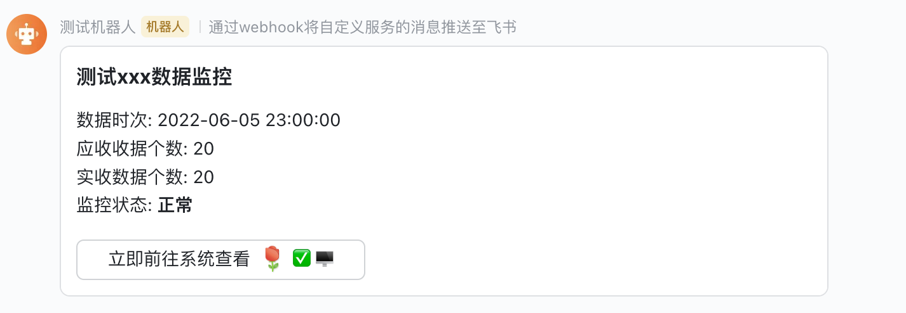

# Prometheus 飞书 AlertManager

> 基于飞书 WebHook 机器人的 Alert Manager 的报警实现

## 1. 使用

``` xml
docker run -d --name prom-alert-feishu -p 9094:8080 --restart=always \
-e FEISHU_TOKEN=xxxx \
javafamily/prometheus-webhook-feishu:2.3.2-SNAPSHOT
```


> 其中 `FEISHU_TOKEN`环境变量为可选参数， 为飞书 webhook 地址或 URL 最后一部分 TOKEN，即 `https://open.feishu.cn/open-apis/bot/v2/hook/${FEISHU_TOKEN}`。
>
> * 如果只对一个飞书群通知，可以添加该环境变量即可；
> * 如果需要对多个飞书群通知， 需要在 `Prometheus` 报警 rule 的 `annotations`中通过指定 `token` 参数为不同飞书群通知；


## 2. Api

> 通知的内容通过 Prometheus 的报警规则配置 `annotations/template` 指定，template 支持 `${xxx}` 占位， XXX 取自 `annotations/xxx` 配置。也可以通过 `annotations/content` 直接指定，不做任何处理直接展示。
>
> **需注意， 飞书通知如果是关键字通知的话，通知内容中需要包含关键字！**

### 2.1 文本通知

`${basePath}/alert/text`

> 文本通知只需要指定 `template` 或者 `content`定义模板内容即可


### 2.2 POST 通知

`${basePath}/alert/post`

> 飞书的 POST 通知可以指定标题（`titleTemplate`/`title`）, 通知内容（`template/content`）, 按钮文本（`btn`）， 按钮链接(`link`)


### 2.3 Card 通知

`${basePath}/alert/card`

> 飞书的 Card 通知可以指定标题（`titleTemplate`/`title`）, 通知内容（`template/content`）, 按钮文本（`btn`）， 按钮链接(`link`)




## 3. 配置报警 rule

``` xml
# 相关的规则设置定义在一个group下。在每一个group中我们可以定义多个告警规则(rule)
groups:
  # 组名。报警规则组名称
- name: 内存预警
  rules:
  - alert: 内存使用率预警
    # expr：基于PromQL表达式告警触发条件，用于计算是否有时间序列满足该条件。
    expr: (node_memory_MemTotal_bytes - (node_memory_MemFree_bytes+node_memory_Buffers_bytes+node_memory_Cached_bytes )) / node_memory_MemTotal_bytes * 100 > 98
    # for：评估等待时间，可选参数。用于表示只有当触发条件持续一段时间后才发送告警。在等待期间新产生告警的状态为pending。
    for: 1m # for语句会使 Prometheus 服务等待指定的时间, 然后执行查询表达式。（for 表示告警持续的时长，若持续时长小于该时间就不发给alertmanager了，大于该时间再发。for的值不要小于prometheus中的scrape_interval，例如scrape_interval为30s，for为15s，如果触发告警规则，则再经过for时长后也一定会告警，这是因为最新的度量指标还没有拉取，在15s时仍会用原来值进行计算。另外，要注意的是只有在第一次触发告警时才会等待(for)时长。）
    # labels：自定义标签，允许用户指定要附加到告警上的一组附加标签。
    labels:
      # severity: 指定告警级别。有三种等级，分别为 warning, critical 和 emergency 。严重等级依次递增。
      severity: critical
    # annotations: 附加信息，比如用于描述告警详细信息的文字等，annotations的内容在告警产生时会一同作为参数发送到Alertmanager。
    annotations:
      title: "内存使用率预警"
      serviceName: "{{ $labels.serviceName }}"
      instance: "{{ $labels.instance }}"
      value: "{{ $value }}"
      btn: "点击查看详情 :玫瑰:"
      link: "http://127.0.0.1/grafana/d/aka/duo-job-ji-cheng-fu-wu-qi-jian-kong"
      # 通过 template 指定通知内容模板
      template: "**${serviceName}**(${instance}) 内存使用率已经超过阈值 **98%**, 请及时处理！\n当前值: ${value}%"
      # 【可选】通过 token 指定通知到不同飞书群
      token: "{{ $labels.feishuToken }}"

- name: 磁盘预警
  rules:
  - alert: 磁盘使用率预警
    expr: (node_filesystem_size_bytes - node_filesystem_avail_bytes) / node_filesystem_size_bytes * 100 > 90
    for: 1m
    labels:
      severity: critical
    annotations:
      title: "磁盘使用率预警"
      serviceName: "{{ $labels.serviceName }}"
      instance: "{{ $labels.instance }}"
      mountpoint: "{{ $labels.mountpoint }}"
      value: "{{ $value }}"
      btn: "点击查看详情 :玫瑰:"
      link: "http://127.0.0.1/grafana/d/aka/duo-job-ji-cheng-fu-wu-qi-jian-kong"
      template: "**${serviceName}**(${instance}) 服务器磁盘设备使用率超过 **90%**, 请及时处理！\n挂载点: ${mountpoint}\n当前值: ${value}%!"
      token: "{{ $labels.feishuToken }}"

- name: 实例存活报警
  rules:
  - alert: 实例存活报警
    expr: up == 0
    for: 30s
    labels:
      severity: emergency
    annotations:
      title: "节点宕机报警"
      serviceName: "{{ $labels.serviceName }}"
      instance: "{{ $labels.instance }}"
      btn: "点击查看详情 :玫瑰:"
      link: "http://127.0.0.1:9090/targets"
      template: "节点 **${serviceName}**(${instance}) 断联, 请及时处理!"
      token: "{{ $labels.feishuToken }}"
```


